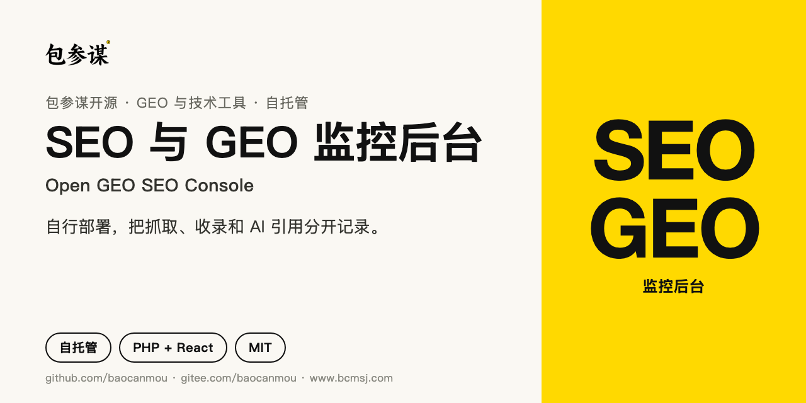
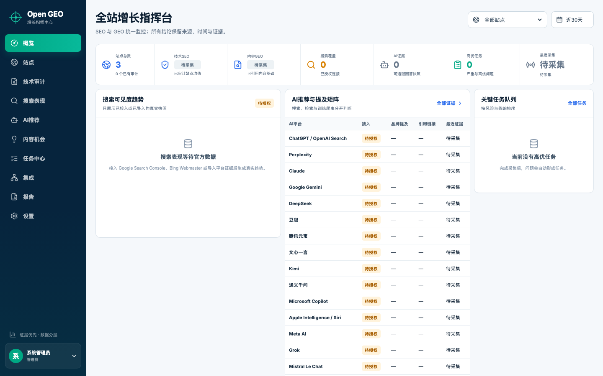
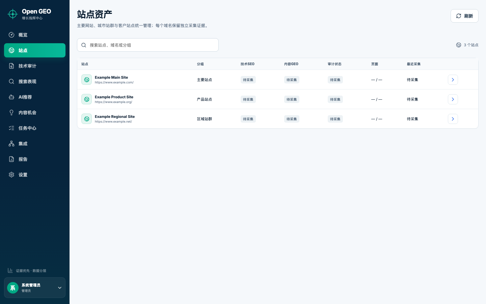
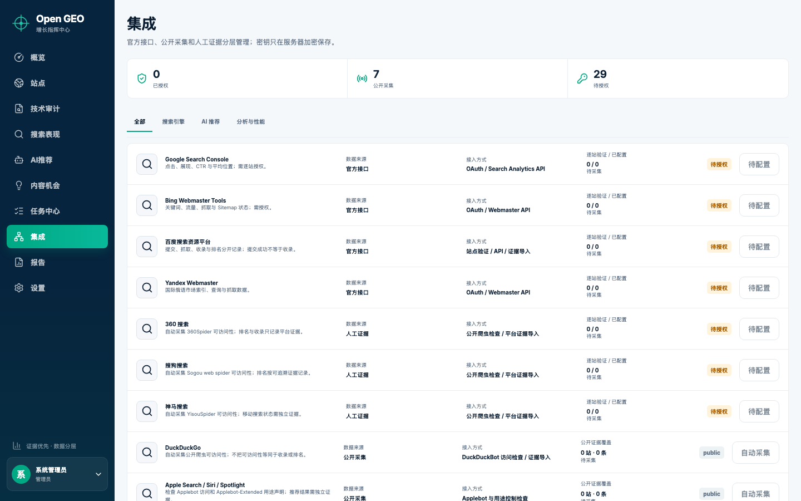
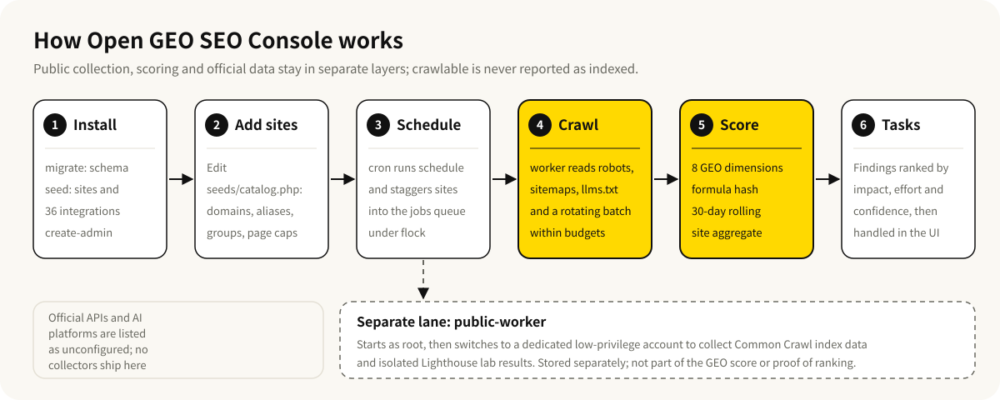

<p align="center">
  
</p>

<p align="center">
  <a href="README.md">简体中文</a> · <strong>English</strong>
</p>

<p align="center">
  
  <a href="LICENSE"></a>
  <a href="https://github.com/baocanmou/open-geo-seo-console/actions/workflows/ci.yml"></a>
  <a href="https://gitee.com/baocanmou/open-geo-seo-console"></a>
</p>

# Open GEO SEO Console

A self-hosted SEO and GEO monitoring console. It collects public pages from several websites on a schedule, records technical issues, crawler access and AI citation readiness as versioned, sourced evidence, and ranks the results into a work queue.

It records only what it can observe: a crawlable page is not an indexed page, an accepted submission is not a ranking, and one AI answer is not a lasting recommendation.

## Who it is for and when to use it

- **Teams running several websites**: register a main site, product site and regional sites, and see technical SEO and GEO status in one console while each domain keeps its own evidence.
- **Checking whether AI crawlers can reach a site**: every audit parses the robots.txt rules for 22 search, retrieval, training and extended-use crawlers.
- **Fixing page structure before worrying about AI recommendations**: the built-in BCM-GEO Core checks whether pages are easy to retrieve, understand, verify and cite, with no third-party account or API key.
- **Keeping site data off third-party platforms**: the console, database and collection jobs all run on your own server.

## What it does

- **Technical audit**: checks HTML, metadata, canonical URLs, headings, structured data, robots.txt, sitemaps, `llms.txt`, response status and response time, and stores the results as findings.
- **Crawler access rules**: parses robots rules for 22 crawlers on every audit. It does not impersonate official bots by default; optional User-Agent probes are labeled as controlled simulations.
- **BCM-GEO Core scoring**: scores pages and sites on 8 dimensions and stores the algorithm version, formula hash, signals and recommendations with every run, so results are reproducible and explainable (see [GEO Core](docs/GEO-CORE.md)).
- **Rolling collection**: each run audits the homepage plus a small rotating batch (4 pages by default, 8 at most) and aggregates distinct-page evidence over a 30-day window instead of crawling everything at once.
- **Task queue**: findings are ranked by score gap, dimension weight, affected pages, confidence and effort, turned into tasks, and their status can be updated in the task center.
- **Integration catalog**: 36 search, AI, analytics and submission integrations, each marked `public` (public collection), `official` (official API) or `manual` (manual evidence).
- **Public data enrichment**: a separate public-worker collects Common Crawl index data and can run self-hosted Lighthouse under an isolated account; these results are stored separately and are not part of the GEO score.
- **Collection safeguards**: every audit is bounded by elapsed time, request count, total bytes and per-document size. If an audit gets a 403/429 and no valid page, further audits pause for a while before retrying.
- **Console security**: Argon2id password hashing, CSRF and same-origin checks, per-account and per-IP failure limits, session expiry and rotation. Administrators can change their password on the Account & Security page, which revokes other sessions.
- **Encrypted storage**: integration configuration is encrypted with libsodium before it is stored, and list endpoints never return secrets.

## Examples

The screenshots below come from a fresh local install of this repository: only `migrate`, `seed` and `create-admin` were run. No audit was run and no real website was contacted. The sites are the reserved example domains from the seed file, so scores read "待采集" (not yet collected) and the search and AI evidence areas stay empty. That is how the console looks before any authorized data exists. The interface is in Chinese.

**Overview**: sites, technical SEO, content GEO, search coverage, AI evidence and high-priority tasks on one page.



**Sites**: the 3 example sites from `backend/seeds/catalog.php`.



**Integrations**: 36 integrations split into official APIs, public collection and manual evidence; anything without authorization stays unconfigured.



## Workflow



## Installation

This is a self-hosted web application (PHP backend, React frontend, MySQL). It is not a Claude Code or Codex plugin and is not installed inside an AI tool.

**Requirements**

- PHP 8.2+ with `curl`, `dom`, `mbstring`, `pdo_mysql` and `sodium`
- MySQL 8.0+
- Node.js 22+ and npm
- Nginx or another HTTPS reverse proxy
- Optional: Chromium and the pinned open-source Lighthouse 12.8.2 CLI for local lab audits

**Get the code**

```bash
git clone https://github.com/baocanmou/open-geo-seo-console.git
# Mirror for networks in mainland China
git clone https://gitee.com/baocanmou/open-geo-seo-console.git
```

**Build the frontend and initialize**

```bash
cp backend/.env.example backend/.env
cd frontend
npm ci
npm run build
cd ..
```

Before starting, set a database password not shared with any other service in `backend/.env` and generate a random `APP_KEY`. Production mode refuses to start when `APP_URL` is not HTTPS, `APP_KEY` is still a placeholder, or session cookies are insecure.

Create the schema, load the example sites and integration catalog, and create the administrator. The default username is `bcm`; pass the password only through the process environment, with at least 16 characters:

```bash
php backend/cli.php migrate
php backend/cli.php seed
read -rs ADMIN_PASSWORD
export ADMIN_PASSWORD
php backend/cli.php create-admin bcm
unset ADMIN_PASSWORD
```

See [Deployment](docs/DEPLOYMENT.md) for the reverse proxy, scheduler and isolated Lighthouse setup, [Architecture](docs/ARCHITECTURE.md) for the system layout, and the [Security Policy](SECURITY.md) for deployment requirements.

**Scheduled collection**

Adapt `deploy/open-geo.cron`. Run `schedule` and `worker` as the web-service account. Only `public-worker` runs as root, so it can switch to the dedicated `open-geo-lighthouse` account.

## Usage

1. **Register your own sites**: edit the `sites` list in `backend/seeds/catalog.php`, replace the example domains with your sites, aliases, groups and page caps, then run `php backend/cli.php seed` again.
2. **Audit a site now**: click the audit button on the site detail page, or run on the server:

   ```bash
   php backend/cli.php queue-site www.example.com
   ```

   The scheduled `worker` processes the queue.
3. **Collect public data for one site**: run Common Crawl and Lighthouse collection for a registered site immediately:

   ```bash
   php backend/cli.php collect-public www.example.com
   ```

   The Lighthouse part requires the dedicated account and firewall isolation from the deployment guide and must run as root; otherwise the application refuses to run it.

All CLI commands: `migrate`, `seed`, `create-admin`, `schedule`, `worker`, `public-worker`, `queue-site <domain>`, `collect-public <domain>`, `queue-public-all`, `cleanup`.

## Boundaries

- **No claims about indexing, ranking or AI recommendation**: public collection shows only what the robots policy says and whether this tool could fetch a page at that moment. Search position, index coverage and AI citation or recommendation require official API data or traceable manual evidence.
- **No official-API or AI-platform collectors yet**: Google Search Console, Bing, Baidu, Yandex, IndexNow and the AI platforms appear as unconfigured in the catalog. The database has tables for search snapshots and AI evidence, but this repository contains no code that fills them automatically. Without data, those views stay empty rather than showing estimates.
- **No scraping of search-result pages**, no keyword-repetition scoring, no treating `llms.txt` as a ranking signal, and no invented metrics.
- **Lighthouse results are lab data**, not Google field data, and do not imply ranking.
- **What needs human review**: GEO recommendations are a ranked work list. Structured data and page evidence must match the visible facts on the page, so changes need editorial review. Before enabling Lighthouse, verify the firewall rules and readiness marker as the deployment guide describes.
- **Public examples only**: the repository uses reserved example domains such as `example.com` and configuration placeholders. It contains no production credentials, customer site inventory, account data, private production paths, audit exports or deployment history. The `/opt`, `/etc`, `/run`, loopback, service-user and TLS paths in the deployment templates are generic placeholders, not copied from a live deployment.
- **Internet-facing consoles** should add provider-level bot protection and preferably MFA or SSO. The built-in account and IP throttles do not fully stop distributed credential stuffing.

## FAQ

**Does it work without any API?**
Yes. Technical audits, crawler-rule checks and BCM-GEO Core scoring use public pages only and need no account or key. Official API data is an optional addition and never replaces or rewrites public evidence.

**How is the GEO score calculated?**
Eight dimensions with fixed weights: retrievability 15%, entity clarity 15%, answerability 18%, evidence and trust 15%, citation readiness 15%, freshness transparency 10%, localization 5%, machine readability 7%. Non-indexable or failed pages are capped at 45. See [GEO Core](docs/GEO-CORE.md) for the formula and evidence boundary.

**Will it crawl my site hard enough to trip a firewall?**
Each run fetches the homepage plus a few rotating pages, with a minimum interval between requests (`CRAWL_MIN_INTERVAL_MS`) and, by default, at least 45 seconds between site audits. If an audit gets 403/429 and no valid page, audits for all sites pause for 60 minutes before one recovery attempt. These limits are in `backend/.env.example` and can be lowered for small hosts.

**Can I preview the interface locally?**
`npm run dev` serves the frontend on `127.0.0.1:4173` and proxies `/api` to `127.0.0.1:8080`. For a local preview, set `APP_ENV=development`, `APP_URL=http://localhost:4173` and keep `SESSION_SECURE=true`, serve the API with `php -S 127.0.0.1:8080 -t backend/public`, and open `http://localhost:4173` (the session cookie uses the `__Host-` prefix, which browsers accept only over HTTPS or on localhost). The screenshots above were produced this way. For production, use HTTPS as described in [Deployment](docs/DEPLOYMENT.md).

**Can I contribute code?**
Issues, reproducible test cases and design discussion are welcome. Until a legally reviewed contribution agreement is published, the project does not merge unsolicited external source code; see [Contributing](CONTRIBUTING.md). Report security issues privately, not in public issues.

## Version and updates

Current version: 1.4.2 (`frontend/package.json`, Git tag `v1.4.2`). There is no CHANGELOG file yet; see [Releases](https://github.com/baocanmou/open-geo-seo-console/releases) and [Tags](https://github.com/baocanmou/open-geo-seo-console/tags) for version history.

## License and attribution

The original code and documentation in this repository are maintained by 南昌包参谋品牌策划有限公司 (Nanchang BaoCanMou Brand Planning Co., Ltd.) and released under the [MIT License](LICENSE); see [NOTICE](NOTICE) for the copyright notice. Third-party dependencies keep their own copyright and licenses; see [THIRD_PARTY_NOTICES.md](THIRD_PARTY_NOTICES.md).

The MIT License covers copyright only. It grants no trademark rights in BCM GEO, 包参谋, BCM or related names and logos, and no access to any production service, customer data, private connector, credential or confidential operating rule. Modified distributions must use their own product name and visual identity; see the [Trademark Policy](TRADEMARKS.md). Ownership and provenance are recorded in [OWNERSHIP.md](OWNERSHIP.md), [PROVENANCE.md](PROVENANCE.md) and `ORIGIN.json`.

## Other BaoCanMou open-source projects

| Project | What it does | China mirror |
|---|---|---|
| [Restaurant Slogans: 10 Methods, 3 Picks](https://github.com/baocanmou/baocanmou-restaurant-slogan) | One restaurant tagline per method from ten masters, then three recommendations | [Gitee](https://gitee.com/baocanmou/baocanmou-restaurant-slogan) |
| [Plans into Presentations](https://github.com/baocanmou/baocanmou-plan-to-ppt) | Turns briefs and research into an editable, source-checked proposal deck | [Gitee](https://gitee.com/baocanmou/baocanmou-plan-to-ppt) |
| [BCM GEO Outcome Engine](https://github.com/baocanmou/bcm-geo-optimizer) | Diagnoses brand mentions, citations and recommendations in AI search | [Gitee](https://gitee.com/baocanmou/bcm-geo-optimizer) |
| [BaoCanMou AI Skill Center](https://github.com/baocanmou/baocanmou-ai-skill-center) | Desktop app that catalogs local AI skills and links them to AI tools | [Gitee](https://gitee.com/baocanmou/baocanmou-ai-skill-center) |

## About BaoCanMou

BaoCanMou (包参谋) — Nanchang BaoCanMou Brand Planning Co., Ltd. — is a brand strategy and design company founded in 2012 in Nanchang, Jiangxi, China. We provide brand positioning, logo and visual identity, packaging, brand space and communication content, mainly for restaurants, chain stores, packaged food and regional specialty brands. Founder: Yi Huiting.

We work positioning first, design second. These tools come from work we repeat in client projects; we write the judgment criteria down so AI can follow the same standard.
