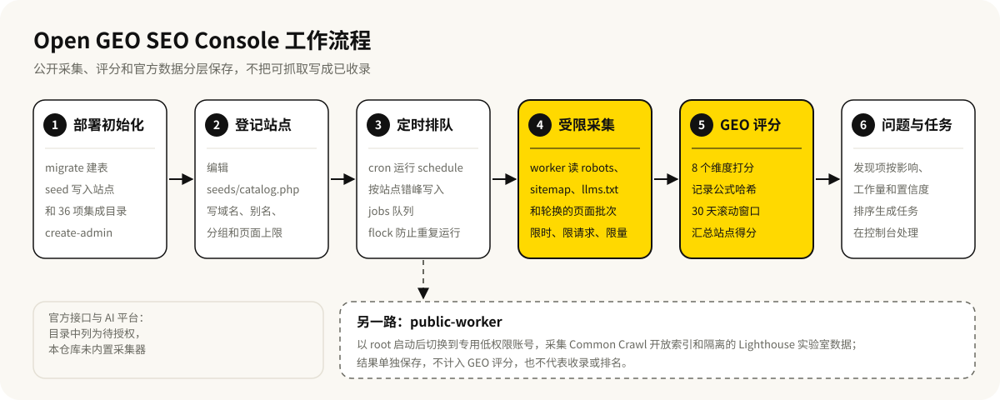

<p align="center">
  
</p>

<p align="center">
  <strong>简体中文</strong> · <a href="README.en.md">English</a>
</p>

<p align="center">
  
  <a href="LICENSE"></a>
  <a href="https://github.com/baocanmou/open-geo-seo-console/actions/workflows/ci.yml"></a>
  <a href="https://gitee.com/baocanmou/open-geo-seo-console"></a>
</p>

# Open GEO SEO Console

一套部署在自己服务器上的 SEO 与 GEO 监控后台：定时采集多个网站的公开页面，把技术问题、爬虫可访问性和 AI 可引用性整理成有版本、有来源的证据，再按影响排成待办任务。

它只记录看得到的事实：页面能抓取不等于已被收录，提交成功不等于有排名，一次 AI 回答也不等于长期推荐。

## 适合谁、什么时候用

- **同时管理多个站点的团队**：主站、产品站、区域站分别登记，在同一个后台看技术 SEO 和 GEO 状态，每个域名的证据单独保存。
- **想知道 AI 爬虫能不能进站**：每次审计都会解析 22 个搜索、检索、训练和扩展用途爬虫在 robots.txt 里的放行规则。
- **想先改页面结构、再谈 AI 推荐**：用内置的 BCM-GEO Core 检查页面是否容易被检索、理解、核实和引用，不需要任何第三方账号或 API 密钥。
- **不想把站点数据交给第三方平台**：后台、数据库和采集任务都跑在自己的服务器上。

## 能做什么

- **技术审计**：检查 HTML、元数据、canonical、标题层级、结构化数据、robots.txt、sitemap、`llms.txt`、响应状态和响应时间，结果写成发现项。
- **爬虫访问规则**：每次审计解析 22 个爬虫的 robots 规则；默认不伪装成官方爬虫发请求，可选的 User-Agent 模拟单独标注为受控模拟。
- **BCM-GEO Core 评分**：从 8 个维度给页面和站点打分，每次保存算法版本、公式哈希、信号和建议，可复现、可解释（详见 [GEO Core](docs/GEO-CORE.md)）。
- **滚动采集**：每次只采首页加一小批轮换页面（默认 4 页，上限 8 页），在 30 天窗口内累积不同页面的证据，避免一次性大量抓取。
- **任务队列**：发现项按分数差距、维度权重、影响页面数、置信度和工作量排序，生成任务，可在任务中心更新状态。
- **集成目录**：内置 36 项搜索、AI、分析和提交类集成记录，分别标为 `public`（公开采集）、`official`（官方接口）或 `manual`（人工证据）。
- **公开数据补充**：独立的 public-worker 采集 Common Crawl 开放索引，并可在隔离账号下运行自托管 Lighthouse；结果单独保存，不并入 GEO 评分。
- **采集保护**：每次审计都有时长、请求数、总字节和单文档大小上限；遇到 403/429 且一页都没拿到时，暂停后续审计一段时间再试。
- **后台安全**：Argon2id 密码哈希、CSRF 与同源校验、按账号和 IP 的失败限流、会话超时与轮换；管理员可在“账户与安全”页修改密码，其他会话随之失效。
- **加密存储**：集成配置在入库前用 libsodium 加密，列表接口不返回密钥。

## 效果示例

下面的截图来自本仓库在本机的一次全新安装：只执行了 `migrate`、`seed` 和 `create-admin`，没有运行审计，也没有连接任何真实网站。站点是种子文件里的保留示例域名，所以评分处显示“待采集”，搜索和 AI 证据保持空白，这正是没有授权数据时后台的真实样子。

**概览**：站点、技术 SEO、内容 GEO、搜索覆盖、AI 证据和高优任务汇总在一页。


**站点资产**：来自 `backend/seeds/catalog.php` 的 3 个示例站点。


**集成**：36 项集成按官方接口、公开采集和人工证据分层，未授权的保持“待授权”。


## 工作流程



## 安装

这是一个自行部署的 Web 应用（PHP 后端 + React 前端 + MySQL），不是 Claude Code 或 Codex 的插件，不需要在 AI 工具里安装。

**环境要求**

- PHP 8.2+，带 `curl`、`dom`、`mbstring`、`pdo_mysql`、`sodium` 扩展
- MySQL 8.0+
- Node.js 22+ 和 npm
- Nginx 或其他 HTTPS 反向代理
- 可选：Chromium 和固定版本的开源 Lighthouse 12.8.2 CLI，用于本地实验室审计

**获取代码**

```bash
git clone https://github.com/baocanmou/open-geo-seo-console.git
# 国内网络可用 Gitee 镜像
git clone https://gitee.com/baocanmou/open-geo-seo-console.git
```

**构建前端并初始化**

```bash
cp backend/.env.example backend/.env
cd frontend
npm ci
npm run build
cd ..
```

启动前在 `backend/.env` 里设置一个不与其他服务共用的数据库密码，并生成随机的 `APP_KEY`。生产模式下，`APP_URL` 不是 HTTPS、`APP_KEY` 仍是占位值或会话 Cookie 不安全时，程序会拒绝启动。

建表、写入示例站点和集成目录、创建管理员。默认用户名是 `bcm`，密码只通过进程环境变量传入，至少 16 个字符：

```bash
php backend/cli.php migrate
php backend/cli.php seed
read -rs ADMIN_PASSWORD
export ADMIN_PASSWORD
php backend/cli.php create-admin bcm
unset ADMIN_PASSWORD
```

反向代理、定时任务和隔离 Lighthouse 的完整步骤见 [部署说明](docs/DEPLOYMENT.md)，系统结构见 [架构说明](docs/ARCHITECTURE.md)，安全要求见 [安全策略](SECURITY.md)。

**定时采集**

参照 `deploy/open-geo.cron` 配置：`schedule` 和 `worker` 用 Web 服务账号运行，只有 `public-worker` 用 root 运行，以便切换到专用的 `open-geo-lighthouse` 账号。

## 使用方法

1. **登记自己的站点**：编辑 `backend/seeds/catalog.php` 的 `sites` 列表，把示例域名换成自己的站点、别名、分组和页面上限，再运行一次 `php backend/cli.php seed`。
2. **立即审计一个站点**：在站点详情页点击审计按钮，或在服务器上执行：

   ```bash
   php backend/cli.php queue-site www.example.com
   ```

   队列由定时运行的 `worker` 处理。
3. **单独采集公开数据**：对一个已登记站点立即执行一次 Common Crawl 和 Lighthouse 采集：

   ```bash
   php backend/cli.php collect-public www.example.com
   ```

   Lighthouse 部分需要先按部署说明完成专用账号和防火墙隔离，并以 root 运行，否则程序会拒绝执行这一项。

CLI 全部命令：`migrate`、`seed`、`create-admin`、`schedule`、`worker`、`public-worker`、`queue-site <domain>`、`collect-public <domain>`、`queue-public-all`、`cleanup`。

## 边界

- **不判断收录、排名和 AI 推荐**：公开采集只能说明 robots 规则怎么写、本工具在当时能否取到页面。搜索排名、索引覆盖、AI 引用或推荐需要官方接口数据或可追溯的人工证据。
- **当前不含官方接口和 AI 平台的采集器**：Google Search Console、Bing、百度、Yandex、IndexNow 以及各 AI 平台在集成目录中显示为“待授权”，数据库里预留了搜索快照和 AI 证据表，但本仓库没有自动写入这些数据的代码。没有数据时页面保持空白，不用估算值填充。
- **不抓取搜索结果页**，不按关键词重复次数加分，不把 `llms.txt` 当作排名信号，也不编造无法获得的指标。
- **Lighthouse 结果是实验室数据**，不是 Google 真实用户数据，也不代表排名。
- **需要人工确认的事**：GEO 建议只是排好序的工作清单，结构化数据和页面证据必须与页面上看得到的事实一致，改动前要人工审核；启用 Lighthouse 前要按部署说明核对防火墙规则和就绪标记。
- **仓库只含公开示例**：仅使用 `example.com` 等保留示例域名和配置占位符，不含生产凭据、客户网站清单、账号数据、私有生产路径、审计导出或部署记录。部署模板里的 `/opt`、`/etc`、`/run`、回环地址、服务账号和 TLS 路径是通用占位，并非取自某个线上环境。
- **面向公网的后台**建议再加服务商层面的机器人防护，并尽量配合 MFA 或 SSO；内置的账号和 IP 限流不能完全防住分布式撞库。

## 常见问题

**不接任何 API 能用吗？**
能。技术审计、爬虫规则检查和 BCM-GEO Core 评分都只用公开页面，不需要账号或密钥。官方接口数据只是额外补充，不会替代或改写公开证据。

**GEO 分数怎么算？**
8 个维度按固定权重加权：可检索性 15%、实体清晰度 15%、可回答性 18%、证据与可信度 15%、可引用性 15%、时效透明度 10%、本地化 5%、机器可读性 7%。无法索引或抓取失败的页面最高 45 分。公式和证据范围见 [GEO Core](docs/GEO-CORE.md)。

**会不会把我的站点抓得太狠，触发防火墙？**
每次审计只取首页加少量轮换页面，请求之间有最小间隔（`CRAWL_MIN_INTERVAL_MS`），站点之间默认至少间隔 45 秒；如果一次审计因 403/429 一页都没取到，会暂停所有站点的审计 60 分钟再试。这些上限都在 `backend/.env.example` 里，可以按主机情况调低。

**能在本机看一下界面吗？**
`npm run dev` 会在 `127.0.0.1:4173` 启动前端，并把 `/api` 转发到 `127.0.0.1:8080`。本机预览时可以把 `APP_ENV` 设为 `development`、`APP_URL` 设为 `http://localhost:4173`、保持 `SESSION_SECURE=true`，用 `php -S 127.0.0.1:8080 -t backend/public` 提供接口，再用 `http://localhost:4173` 访问（会话 Cookie 带 `__Host-` 前缀，浏览器只在 HTTPS 或 localhost 下接受）。上面的截图就是这样得到的。生产环境请按 [部署说明](docs/DEPLOYMENT.md) 使用 HTTPS。

**可以提交代码吗？**
欢迎提交问题、可复现的测试用例和设计讨论。在发布经过法律审核的贡献协议之前，项目不合并未经约定的外部代码，详见 [贡献说明](CONTRIBUTING.md)。安全问题请走私密漏洞报告，不要发公开 issue。

## 版本与更新

当前版本 1.4.2（`frontend/package.json`，Git 标签 `v1.4.2`）。仓库暂无 CHANGELOG 文件，版本记录见 [Releases](https://github.com/baocanmou/open-geo-seo-console/releases) 和 [Tags](https://github.com/baocanmou/open-geo-seo-console/tags)。

## 许可与署名

本仓库的原创代码和文档由南昌包参谋品牌策划有限公司维护，以 [MIT 许可](LICENSE) 发布，版权声明见 [NOTICE](NOTICE)。第三方依赖保留各自的版权和许可，见 [THIRD_PARTY_NOTICES.md](THIRD_PARTY_NOTICES.md)。

MIT 许可只涉及著作权，不授予 BCM GEO、包参谋、BCM 等名称和标志的商标权，也不提供任何生产服务、客户数据、私有连接器、凭据或内部运营规则的访问权。修改后再发布的版本请使用自己的产品名称和视觉形象，详见 [商标政策](TRADEMARKS.md)。所有权边界和来源记录见 [OWNERSHIP.md](OWNERSHIP.md)、[PROVENANCE.md](PROVENANCE.md) 和 `ORIGIN.json`。

## 包参谋其他开源项目

| 项目 | 做什么 | 国内镜像 |
|---|---|---|
| [餐饮广告语·十法三选](https://github.com/baocanmou/baocanmou-restaurant-slogan) | 按 10 种名家方法各写一条餐饮广告语，比较后推荐 3 条 | [Gitee](https://gitee.com/baocanmou/baocanmou-restaurant-slogan) |
| [策划资料变 PPT](https://github.com/baocanmou/baocanmou-plan-to-ppt) | 把简报和调研做成有来源、可编辑的提案 PPT | [Gitee](https://gitee.com/baocanmou/baocanmou-plan-to-ppt) |
| [GEO 效果优化](https://github.com/baocanmou/bcm-geo-optimizer) | 诊断品牌在 AI 搜索中的提及、引用和推荐，按证据排改进任务 | [Gitee](https://gitee.com/baocanmou/bcm-geo-optimizer) |
| [包参谋 AI 技能中心](https://github.com/baocanmou/baocanmou-ai-skill-center) | 盘点本机 AI Skill 并统一连接多种 AI 工具的桌面应用 | [Gitee](https://gitee.com/baocanmou/baocanmou-ai-skill-center) |

## 关于包参谋

包参谋，全称南昌包参谋品牌策划有限公司，2012 年创立于江西南昌，提供品牌定位、Logo/VI 设计、包装设计、品牌空间与传播内容服务，主要服务餐饮、连锁门店、食品快消和地方特色品牌。创始人易慧庭。

我们先定位，后设计。这些开源工具来自我们在实际项目里反复做的工作，我们把判断标准写清楚，让 AI 按同样的标准做事。
